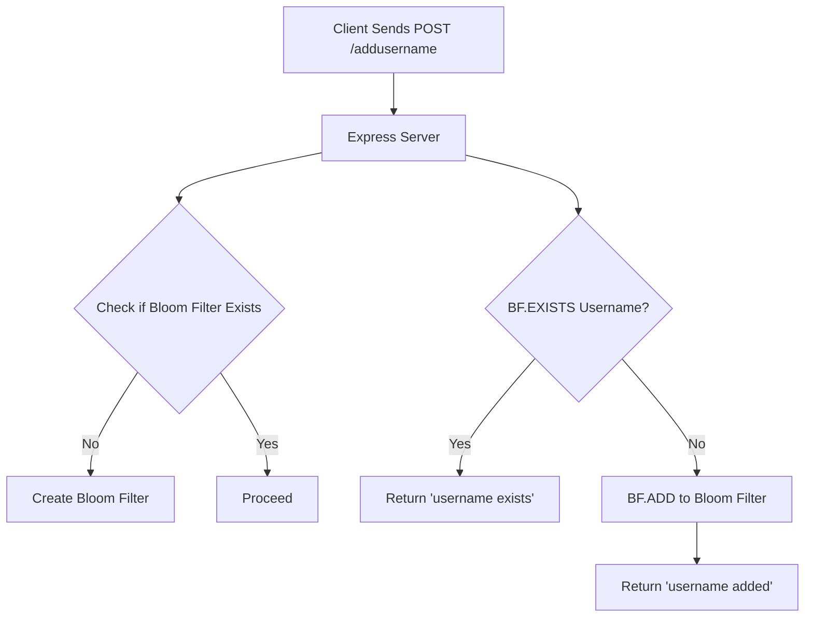

# 🌸 Redis Bloom Filter Example with Node

This project demonstrates a simple use case of a **Bloom Filter** using **Redis Stack** with an **Node** server. It efficiently checks whether a username has been added using a probabilistic data structure.

---

## 📦 Features

- 🚀 Lightweight Node server
- 🧠 Uses Redis Stack's [Bloom Filter module](https://redis.io/docs/interact/search-and-query/bloom/) via the `ioredis` client
- 🐳 Redis runs via Docker Compose
- 💡 Simple `/addusername` endpoint to demonstrate usage
- 🔁 Prevents duplicate usernames with fast lookup

---

## 🧪 How It Works

### 🔬 What is a Bloom Filter?

A **Bloom filter** is a **probabilistic data structure** that answers the question: _“Is this element in the set?”_ with:
- ✅ Guaranteed no false negatives
- ⚠️ Possibility of false positives (rare, controllable with tuning)
- 🧠 Excellent for high-speed existence checks

We use Redis Stack's built-in **Bloom filter commands**:
- `BF.RESERVE` – Initializes a filter
- `BF.ADD` – Adds an item
- `BF.EXISTS` – Checks for existence

---

### ⚙️ Architecture Diagram


---
🛠️ Tech Stack

| Tech |  Description  |
|:-----|:--------:|
| *Node.js*   | JavaScript runtime for backend |
| *Redis Stack*   |  Redis + modules (Bloom, JSON etc.)  |
| *ioredis*   | Redis client for Node.js |
| *Docker*   | for redis stack image |


---

## 📦 Project Structure

```
📁 Project Structure
    /bloom-filter-redis
    ├── index.js
    ├── docker-compose.yml
    ├── package.json
    └── README.md
```

---

---

📦 Setup Instructions

```bash
# 1. Clone the repository
git clone https://github.com/Minhajxdd/bloom-filter-redis
cd bloom-filter-redis

# 2. settup redis stack server
docker compose up -d

# 3. install dependencies
pnpm install

# 4. start node server
node index.js
```

---

## 📜 License

MIT © 2025
